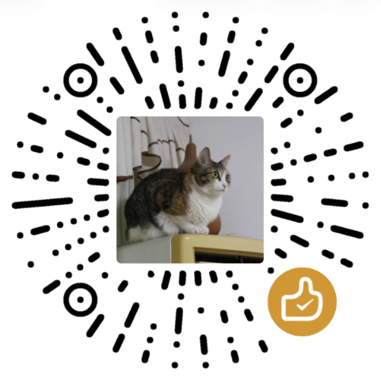

# Phantom - A new type of Captcha !

### [中文版本 >>>](README.md)

> BUILT BY A 15-YEAR-OLD TEEN IN CHINA !

> Traditional image CAPTCHAs are easily cracked by AI, and slider curves are easily simulated by scripts. Phantom doesn't compete on "image memorization" — it competes only on "whether you are a real human with a body and a retina."

## Dual Lines of Defense

### 1. Visual Defense · Dynamic Development
The CAPTCHA target square is hidden in a screen full of dynamic noise. **Only when particles are in motion** can the human eye recognize the shape via "Common Fate" and retinal temporal integration. Any **single-frame screenshot** is just a chaotic blob of noise, rendering frame-by-frame CV/VLM analysis completely useless.

- Background particles are fully re-randomized each frame (uncorrelated between frames) → each frame is pure high-entropy noise
- Particles within the target area are **re-randomized within the square each frame** and then a **common displacement vector** is applied → coherent motion reveals the shape, while the density inside/outside the area remains identical (no density trap)
- Anti-density analysis: random brightness flicker prevents pixel-density scraping
- **Static-frame protection**: after the challenge loads, the canvas shows only static noise — **the dynamic reveal only starts while the user holds the button**; releasing instantly degrades back to pure noise, guaranteeing that any static screenshot carries no target information

### 2. Behavioral Defense · Biological Rhythm
The user holds the button and follows the moving square. The system **doesn't look at coordinate precision, only at the "humanity" of the trajectory**: human neural-conduction latency inevitably produces a "lag → follow-up → deviation → correction" rhythm, accompanied by irreducible micro-tremors and nonlinear acceleration/deceleration. Machine trajectories are "too perfect" — instant veto.

> Interaction details: pressing the button starts the dynamic reveal of the square from the start point and captures the trajectory; releasing stops the motion (the slider stays put, the canvas degrades to pure noise) and automatically submits the captured trajectory for scoring.

## Core Verdict

```
Composite = W_DTW · S_DTW + W_BIO · S_Bio              default 0.6 / 0.4, threshold 0.8
S_Bio     = W_JERK·energy + W_ZC·zc + W_PSD·tremor      default 0.4 / 0.3 / 0.3
```

> All weights, thresholds, frequency bands, and energy/zero-crossing boundaries **are adjustable via environment variables** (see "Configuration" below).

- **S_DTW**: DTW distance between the actual trajectory and the Bezier path issued by the backend (directional fit)
- **S_Bio**: measured on the **residual** after a 4th-order bidirectional Butterworth low-pass filter (cutoff 7 Hz)
  - Residual energy (humans 0.3–8 px; perfect machine ≈0; crude machine >20 px)
  - Acceleration zero-crossing frequency (humans ≥5 times in 3 seconds, bell-shaped range)
  - 8–12 Hz tremor amplitude and power proportion
- **Smoothness veto**: residual energy ≈0 (over-smoothed) → `S_Bio=0.05`, Composite capped at **0.20**

## Security Design

| Requirement | Implementation |
|---|---|
| Zero frontend trust / dynamic keys | Per-session ECDH P-256 ephemeral key + AES-256-GCM, no global hardcoded keys |
| High-strength anti-reverse-engineering | `vite-plugin-javascript-obfuscator`: control-flow flattening + debugProtection + string array + identifier renaming; runtime anti-debugging infinite loop |
| Strict time-difference prevention | Server validates `last_point_t` within `MAX_DRIFT_SECONDS` of now (default 3s, prevents offline slow computation) |
| One challenge per answer / one token per use | Redis `GETDEL` atomically pops challenge and token; destroyed regardless of success or failure |

## Directory Structure

```
phantom/
├── backend/                 # FastAPI + scipy + cryptography + redis
│   ├── app/
│   │   ├── main.py          # routes /challenge /verify /consume-token
│   │   ├── config.py        # centralized thresholds / TTL config
│   │   ├── crypto.py        # ECDH + HKDF + AES-GCM + token HMAC
│   │   ├── challenge.py     # Bezier path generation + encrypted parameter delivery
│   │   ├── store.py         # async redis GETDEL wrapper
│   │   └── scoring/         # DSP verdict core (dsp / dtw / engine)
│   ├── tests/               # 12 unit tests, all passing
│   └── .env.example
├── frontend/                # vanilla TS + Vite + Canvas2D
│   └── src/
│       ├── renderer.ts      # dynamic reveal (visual defense core)
│       ├── tracker.ts       # pointer trajectory capture
│       ├── crypto.ts        # Web Crypto ECDH/AES-GCM
│       ├── api.ts           # /challenge /verify /consume-token
│       ├── antidebug.ts     # devtools detection → infinite loop
│       ├── phantom.ts       # SDK public entry: Phantom.mount()
│       ├── styles.ts        # injected widget styles
│       └── main.ts          # state machine orchestration (official demo entry)
├── docker-compose.yml       # full-stack deployment: Redis + backend + frontend
└── README.md
```

## Quick Start

### One-click Docker deployment

```docker compose up -d --build```

### Manual deployment

### 1. Start Redis

```bash
docker compose up -d redis
# or run redis-server directly if already installed locally
```

### 2. Start the backend

```bash
cd backend
python3 -m venv .venv && . .venv/bin/activate
pip install -e ".[dev]"
cp .env.example .env          # modify as needed
uvicorn app.main:app --reload --port 8000
```

Health check: `curl http://localhost:8000/health` → `{"ok":true}`

### 3. Start the frontend

```bash
cd frontend
npm install
npm run dev                   # http://localhost:5173
```

Open `http://localhost:5173` in your browser, **press and hold the "Hold to follow the square" button** (the dynamic reveal starts the moment you press), follow the moving square with your eyes for about 5 seconds, then release to get the verdict.

### 4. Production build (high-strength obfuscation)

```bash
cd frontend && npm run build  # outputs dist/, control-flow flattening + anti-debugging
```

## Run Tests

```bash
cd backend && . .venv/bin/activate
pytest -v                     # 12 tests: scoring / crypto / api full pipeline
```

Test coverage:
- **Scoring**: synthetic human trajectory passes, perfect machine gets vetoed by smoothness (capped at 0.20), crude noisy machine fails, insufficient points rejected
- **Cryptography**: ECDH both parties derive identical key, AES-GCM round-trip and tamper detection, token issuance/verification
- **API**: full pipeline passes, one challenge per answer (second verify returns 410), 3s TTL interception, invalid curve rejected, token one-time use

## Configuration

All tunable parameters are centralized in `.env` (see `.env.example` / `backend/.env.example`).

- **Backend `PHANTOM_*`**: takes effect after restarting the backend container (`docker compose up -d`)
- **Frontend `VITE_*`**: injected at Vite build time, must rebuild the frontend image via `docker compose up -d --build` after changes
- **Canvas dimensions**: change only `PHANTOM_CANVAS_W/H` — the backend generates paths based on it, and the frontend `VITE_CANVAS_W/H` reads from the same variable to guarantee consistency (otherwise the path goes out of bounds)

### Basics / Security

| Env Variable | Default | Description |
|---|---|---|
| `PHANTOM_REDIS_URL` | `redis://localhost:6379/0` | Redis connection |
| `PHANTOM_CORS_ORIGINS` | three local origins | Allowed frontend origins (comma-separated; add the origin of every integrating site) |
| `PHANTOM_TOKEN_SECRET` | random per process | token HMAC key (production must inject `openssl rand -hex 32`) |
| `PHANTOM_CHALLENGE_TTL` / `PHANTOM_TOKEN_TTL` | 120 / 300 | challenge / token lifetime (seconds) |
| `PHANTOM_MAX_DRIFT_SECONDS` | `3.0` | submission TTL ceiling: max offset of `last_point_t` from now (prevents offline slow computation) |
| `PHANTOM_CLOCK_SKEW_MS` | `1500` | frontend/backend clock skew tolerance (milliseconds) |

### Canvas / Difficulty

| Env Variable | Default | Description |
|---|---|---|
| `PHANTOM_CANVAS_W` / `PHANTOM_CANVAS_H` | `480` / `480` | Canvas dimensions (single source of truth; frontend `VITE_CANVAS_*` stays in sync) |
| `PHANTOM_CHALLENGE_DURATION` | `5.0` | Duration the square travels along the Bezier path (seconds) — determines speed and difficulty |
| `PHANTOM_TARGET_HALF` | `22` | Target square half side length (canvas-relative) |
| `PHANTOM_FPS` | `60` | Frame rate (delivered as a contract only) |

### Scoring Weights

| Env Variable | Default | Description |
|---|---|---|
| `PHANTOM_PASS_THRESHOLD` | `0.8` | Composite-score pass threshold |
| `PHANTOM_W_DTW` / `PHANTOM_W_BIO` | `0.6` / `0.4` | Composite weights; raising W_DTW leans toward "tracking accuracy" |
| `PHANTOM_W_JERK` / `PHANTOM_W_ZC` / `PHANTOM_W_PSD` | `0.4` / `0.3` / `0.3` | Internal S_Bio weights (energy / zero-crossing / tremor) |
| `PHANTOM_DTW_D_REF_RATIO` | `0.15` | DTW decay scale (larger = more lenient; per-point deviation at this fraction of the diagonal gives S≈0.37) |
| `PHANTOM_SMOOTHNESS_EPS` / `_CAP` / `_BIO` | `0.08` / `0.20` / `0.05` | Smoothness veto line / Composite cap / veto-state S_Bio |

### DSP / Physiological Feature Thresholds

| Env Variable | Default | Description |
|---|---|---|
| `PHANTOM_DSP_FS` | `100` | Upsampling target frequency (Hz) |
| `PHANTOM_BUTTER_ORDER` / `PHANTOM_BUTTER_CUTOFF` | `4` / `7.0` | Butterworth order / cutoff frequency (Hz) |
| `PHANTOM_TREMOR_LO_HZ` / `PHANTOM_TREMOR_HI_HZ` | `8.0` / `12.0` | Physiological tremor band (Hz) |
| `PHANTOM_ENERGY_MIN/LOW/HIGH/MAX` | `0.1/0.3/8.0/20.0` | Residual energy boundaries (px); LOW~HIGH is the physiological range |
| `PHANTOM_ZC_FLOOR/RISE/PLATEAU/DROP` | `1.0/1.67/15.0/40.0` | Acceleration zero-crossing rate boundaries (times/sec); RISE~PLATEAU is the full-score range |
| `PHANTOM_TREMOR_AMP_MIN/LOW/HIGH/MAX` | `0.05/0.3/8.0/20.0` | Tremor amplitude boundaries (px) |
| `PHANTOM_TREMOR_PSD_MIN/LOW/MID` | `0.02/0.4/0.13` | Tremor spectral proportion segments |
| `PHANTOM_W_TREMOR_AMP` / `PHANTOM_W_TREMOR_PSD` | `0.5` / `0.5` | Internal weights within the tremor sub-score |
| `PHANTOM_MIN_POINTS` | `30` | Lower bound on valid trajectory points |

### Frontend Rendering Parameters (injected at Vite build time; requires `--build` after changes)

| Env Variable | Default | Description |
|---|---|---|
| `VITE_API_BASE` | `/api` | Backend address (production can use a standalone domain) |
| `VITE_PARTICLE_DENSITY` | `0.6` | Proportion of bright particles per pixel in the target square (larger = denser) |
| `VITE_PARTICLE_DROP_RATE` | `0.05` | Anti-density analysis: fraction of particles randomly dropped per frame |
| `VITE_PARTICLE_BRIGHTNESS` | `0.55` | Base brightness of the target cluster (0~1) |
| `VITE_PARTICLE_BRIGHTNESS_VAR` | `0.45` | Random brightness flicker amplitude |

> Frontend `VITE_*` falls back to defaults when invalid or missing; invalid `PHANTOM_*` also falls back (won't affect startup).

## Data Flow

```
Frontend ──ECDH public key──▶ /challenge ◀── Backend generates ECDH + session key + Bezier path
   ◀── Backend public key + encrypted path params ──
Frontend derives the same session key from ECDH → decrypts path → Canvas dynamic reveal
User holds the activation key and follows the square for 5s → tracker captures trajectory
Frontend AES-GCM encrypts the trajectory ──▶ /verify (submitted immediately, MAX_DRIFT_SECONDS TTL)
Backend GETDEL challenge (one-time destruction) → decrypt → score → issue token
Business server ──token──▶ /consume-token ◀── GETDEL (one token per use)
```

## Integration & Deployment

### Integrate Phantom into your site

Phantom provides a **script-tag SDK**; integrators embed it with one `<script>` tag + a container `div`, similar to reCAPTCHA:

```html
<script src="https://phantom.your-domain.com/phantom.js"></script>
<div id="phantom-box"></div>
<script>
  Phantom.mount("#phantom-box", {
    apiBase: "https://phantom.your-domain.com",
    onSuccess: (r) => console.log("token =", r.token),   // send the token to your backend for redemption
    onFail:   (r) => console.log("failed", r.detail),
  });
</script>
```

> ⚠️ The token is a **one-time human-verification voucher**; it must be redeemed by your business backend via `/consume-token` — **do not redeem it in the browser**. The complete integration flow (frontend embedding + backend redemption loop) is in the **[Integration Guide](./docs/integration.md)**.

### One-click full-stack deployment (Docker Compose)

```bash
cp .env.example .env          # edit: set PHANTOM_CORS_ORIGINS, PHANTOM_TOKEN_SECRET
docker compose up -d --build  # Redis + backend + frontend nginx, one command for the full stack
# http://localhost           → official demo
# http://localhost/demo.html → integration example page
# https://…/phantom.js       → SDK package (referenced by integrators)
```

Before production deployment, be sure to set a stable `PHANTOM_TOKEN_SECRET` (`openssl rand -hex 32`) and your site's domain `PHANTOM_CORS_ORIGINS` in `.env`.

### Directory Structure (Integration-related)

```
phantom/
├── frontend/
│   ├── src/phantom.ts       # SDK public entry: Phantom.mount() factory
│   ├── src/styles.ts        # injected widget styles (dark/light themes)
│   ├── vite.sdk.config.ts   # SDK build: outputs phantom.js (IIFE + obfuscation)
│   ├── public/demo.html     # simulated third-party integration example page
│   ├── Dockerfile           # frontend image (node build → nginx hosting + /api reverse proxy)
│   └── nginx.conf
├── backend/Dockerfile       # backend image (multi-stage, scipy compilation optimized)
├── examples/mock-biz-server.py  # simulated integrator business backend (demonstrates token redemption loop)
├── docker-compose.yml       # full stack: redis + backend + frontend
├── .env.example             # Compose deployment environment variables
└── docs/integration.md      # ★ Complete documentation for integrating developers
```

---

## Buy me a coffee ~



